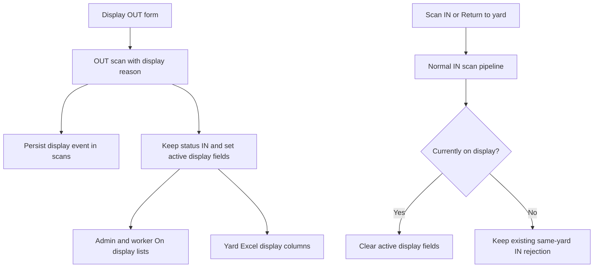

# Display Vehicles Design

## Goal

Add `Display` as an OUT reason. A display vehicle remains assigned to and counted as IN at its current yard, while the system records:

- Person responsible for taking the car
- Display location

Admin users and stockyard workers can see display vehicles separately and return one vehicle at a time. Yard Excel exports include display vehicles and their display details.

## Confirmed behavior

- `Display` is available in QR OUT, manual OUT, and admin OUT flows.
- Responsible person and display location are required free-text fields.
- A display vehicle keeps `current_status = 'in'` and its current yard.
- It continues counting toward yard stock, occupancy, utilization, and dwell.
- It is unavailable for customer acquisition OUT, stockyard transfer, and transfer requisitions until returned.
- Admin and stockyard workers see an `On display` filter and badge.
- Each display vehicle shows its responsible person, location, and a `Return to yard` action.
- A physical same-yard IN scan also returns a display vehicle.
- Returning clears the active display fields but preserves scan history.

## Architecture

The feature extends the existing scan pipeline rather than adding a separate status override.



## Data model

Add nullable columns only.

`scans`:

```ts
display_taken_by: text('display_taken_by'),
display_location: text('display_location'),
```

`vehicle_status`:

```ts
on_display: boolean('on_display'),
display_taken_by: text('display_taken_by'),
display_location: text('display_location'),
```

The scan columns preserve event history. The status columns expose the active display assignment efficiently to lists and exports. Existing `NULL` values mean “not on display.”

## Existing-data safety contract

Implementation must not mutate existing vehicle, status, scan, yard, requisition, or user data.

- Schema changes are additive and nullable.
- No columns are renamed or dropped.
- No existing column types, defaults, or constraints are changed.
- No backfill infers display state from historical data.
- No `db:push`, seed, clear, drop, migration application, or production database command runs during implementation or verification.
- Tests, builds, and lint checks must not connect to or write to the configured database.
- Applying a reviewed additive schema migration is a separate deployment action requiring explicit approval.
- Only future user actions update display state for the selected vehicle.

## Backend behavior

### Display OUT

Extend OUT validation to accept `display`. Require trimmed non-empty `display_taken_by` and `display_location`.

For a display OUT:

- Insert an accepted OUT scan containing the reason and display fields.
- Keep `current_status = 'in'`.
- Keep the current yard.
- Set `on_display = true` and copy the active display fields to `vehicle_status`.
- Reject if the vehicle is already on display.

For any vehicle currently on display:

- Reject customer acquisition OUT.
- Reject stockyard transfer OUT.
- Reject creation of a transfer requisition.
- Exclude it from available-yard-stock and requisition pickers.

These rules are enforced by the backend. Frontend disabling and filtering provide additional guidance but are not the security boundary.

### Return to yard

The current IN processor rejects a vehicle already IN at the same yard. Before that existing rejection, add a narrow exception:

- If the vehicle is IN at that yard and `on_display = true`, accept the IN scan as a return.
- Insert/update the normal IN scan audit fields.
- Clear `on_display`, `display_taken_by`, and `display_location`.
- Do not create a duplicate-IN flag.

If the vehicle is IN and not on display, preserve the existing rejection unchanged.

The list’s `Return to yard` button creates the same manual-entry IN scan. It does not use admin force override or a second state-transition endpoint.

### Admin overrides

If an admin force-changes a vehicle away from the display-IN state, clear active display fields to prevent impossible combinations such as `current_status = 'out'` with `on_display = true`. This affects only the vehicle explicitly changed after release.

## Frontend behavior

Extend the shared scan model, API serialization, server hydration, and offline `applyScan` logic with display fields.

Offline behavior mirrors backend rules:

- Display OUT keeps the vehicle IN and marks it on display.
- Another OUT is blocked while displayed.
- Same-yard IN is accepted only as a display return.
- A successful return clears active display fields.

Add `Display` and its required fields to:

- Yard QR/camera OUT
- Yard manual VIN OUT
- Admin per-vehicle OUT

Confirmation screens show the display reason, responsible person, and location.

## Visibility and return UI

Admin yard views and stockyard-worker yard inventory provide:

- `All`
- `Parked IN`
- `On display`
- `Moved OUT`

`Parked IN` excludes display vehicles. `On display` includes only IN vehicles with `on_display = true`. Overall IN/capacity counts continue including display vehicles.

Display rows show:

- `On display` badge
- Responsible person
- Display location
- `Return to yard` button

Return is one vehicle at a time, requires confirmation, disables while syncing, and uses existing error feedback.

General vehicle views show the badge so display vehicles are not mistaken for physically parked stock.

## Excel export

Yard Excel exports continue including every vehicle assigned to the yard. Add:

- `On Display`
- `Taken By`
- `Display Location`

Display vehicles remain present because they retain the yard and IN status. Non-display and historical vehicles receive blank display columns.

## Timeline

Display OUT events show:

- Reason: Display
- Taken by
- Display location

The event remains an OUT scan for audit purposes, while active status remains IN/on-display.

## Cross-project effects

Must change:

- Scan validation and processing
- Offline scan processing and bulk serialization
- Vehicle-list API and frontend hydration
- QR/manual/admin OUT forms
- Admin and stockyard display lists
- Requisition creation and available-stock queries
- Yard Excel export
- Timeline labels

Must preserve:

- Capacity and utilization calculations
- Non-display same-yard IN rejection
- Transit receive behavior
- Delivered cleanup
- Existing scan and vehicle data

Deferred:

- Admin CSV display columns
- Nipponstock display-location synchronization
- Display notifications
- Predefined display locations

## Error handling

- Missing responsible person or location: reject before submission and validate again on the server.
- Already on display: reject another display or OUT action with “Return vehicle from display first.”
- Requisition attempt: reject with a clear on-display-unavailable message.
- Return of non-display IN vehicle: preserve existing same-yard IN rejection.
- Sync failure: retain local pending/error behavior and do not clear the display row until the accepted return is reflected.

## Testing

Backend:

- Display OUT remains IN and sets active display fields.
- Missing display fields are rejected.
- Second display, customer acquisition, transfer, and requisition are rejected while displayed.
- Available-stock queries exclude displayed vehicles.
- Same-yard IN returns a displayed vehicle and clears active fields.
- Same-yard IN for a non-display vehicle remains rejected.
- Admin status override cannot leave stale display fields.

Frontend:

- Display payload serialization and hydration.
- Offline display OUT and return transitions match the backend.
- Admin and stockyard filters, badges, details, and individual return.
- Excel includes display vehicles and fields.
- Non-display export rows remain valid with blank display columns.

Data safety:

- No database-writing command is part of verification.
- Existing rows require no update or backfill.
